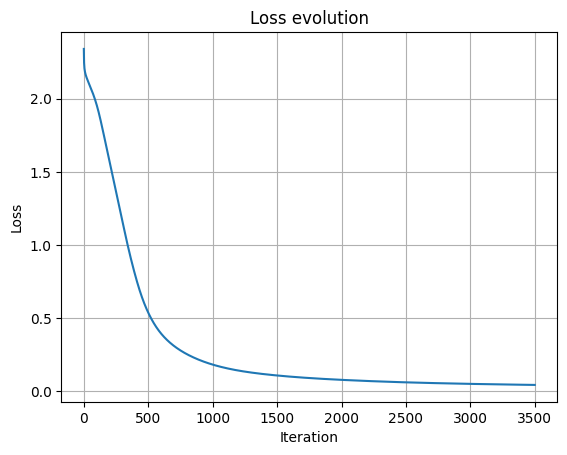

# modular-neural-network-from-scratch
## Project Description

This repository contains a fully modular neural network implemented from scratch in NumPy, trained on the Pen-Based Recognition of Handwritten Digits dataset (UCI ML Repository).
The goal of this project is to demonstrate a deep understanding of:
- Forward propagation
- Backpropagation and gradient derivation
- Multi-layer neural networks
- Softmax + Cross-Entropy for multi-class classification
- Numerical stability & weight initialization
- Training loops, accuracy computation, normalization
- Building a customizable and extensible neural network framework
No deep learning library (PyTorch, TensorFlow…) was used — only NumPy.

## Key Features
### Modular Architecture
You can freely define:
- Number of layers
- Number of neurons per layer
- Activation functions per layer
- Learning rate & training duration

### Forward & Backward Propagation Implemented Manually
Vectorized math only (NumPy)
Supports any activation function that defines:
- Forward_prop()
- Backward_prop()
Only ReLU, Sigmoid and Softmax have been implmented but more could be easly implemented.

### Multi-Class Classification
- Softmax output layer
- One-hot encoding
- Cross-entropy loss (numerically stable)

### Training Pipeline
- Dataset preprocessing
- Feature scaling
- Train/validation/test split
- Gradient descent optimizer
- Loss tracking
- Prediction & accuracy evaluation

## Model Architecture (Example)
Input (16 features)
      ↓
Linear (16 → 32)
      ↓
ReLU
      ↓
Linear (64 → 16)
      ↓
ReLU
      ↓
Linear (16 → 10)
      ↓
Softmax
      ↓
Cross-Entropy Loss

## Loss curve

## Required package
- Numpy
- Matplotlib
- Pandas

## What I learned
- How to generalize the computing of gradient
- Deepen my understanding of backpropagation
- Implementing vectorized operations and managing matrix dimensions
- Diagnosing overfitting, wrong learning rate(either too low or too hight) and how to solve those issues
- Building a small but clean ML training pipeline from scratch
- Deepen my knowledge and understanding of numpy function, python class...
- Debuging
- Optimizing parameters such the number of layers, the number of neurones inside each layer, the learning rate, number of iterations, impact of the activation function...

## Performance
- Validation accuracy 95.8%
  
## Possible improvements
- Add dropout to prevent overfitting
- Use mini-batch method to reduce training time on large dataset, add more activation function

